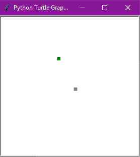

# Snake Game
 Repository for a Snake game, programmed with Python.
 
## Table of Contents
* [General info](#general-info)
* [Technologies](#technologies)
* [Setup](#setup)
* [Status](#status)
* [Inspiration](#inspiration)

## General info
This is repository contains a classic Snake game.  
It must look like this when your run the code:



## Technologies
* Python 3.7.7
* Freegames 2.3.2
* Turtle and random were included with Python.

## Setup
To properly run (and play) this game, you'll need to import some Python packages: freegames, turtle and random.
As seen on this part of the code:

```Python
from turtle import *
from random import randrange
from freegames import square, vector
```

## Status
This code is already finished.

## Inspiration
This proyect is inspired by the Snake game code at [Grant Jenks](http://www.grantjenks.com/docs/freegames/snake.html) website.

## Collaborators
* [Luis Martínez](https://github.com/A01570852)
* [Edgar Castillo](https://github.com/EdgarCastilloRm)
